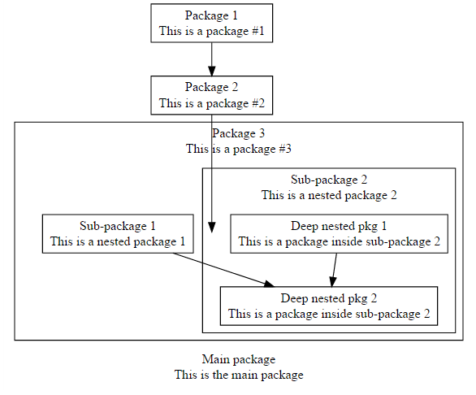
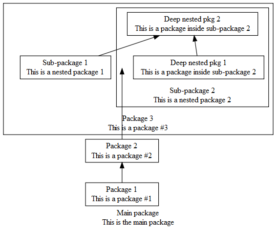
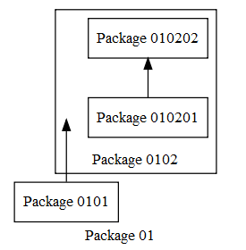

# depmodelr

Dependency diagrams

## Install


```r
devtools::install_github("bergant/depmodelr")
```

## Usage

Define modules and dependencies with YAML:

```yaml
refId: main_package
name: "Main package"
description: "This is the main package"
executables:
- refId: pkg1
  name: "Package 1"
  description: "This is a package #1"
- refId: pkg2
  name: "Package 2"
  description: "This is a package #2"
- refId: pkg3
  name: "Package 3"
  description: "This is a package #3"
  executables:
  - refId: subPkg1
    name: "Sub-package 1"
    description: "This is a nested package 1"
  - refId: subPkg2
    name: "Sub-package 2"
    description: "This is a nested package 2"
    executables:
    - refId: subnest1
      name: "Deep nested pkg 1"
      description: "This is a package inside sub-package 2"
    - refId: subnest2
      name: "Deep nested pkg 2"
      description: "This is a package inside sub-package 2"
    references:
    - from: subnest1
      to: subnest2
  references:
  - from: subPkg1
    to: subnest2
references:
- from: pkg1
  to: pkg2
- from: pkg2
  to: subPkg2
```


```r
library(yaml)
dep1 <- yaml.load_file(system.file("example.yml", package = "depmodelr") )
```

Create Graphviz DOT Code

```r
library(depmodelr)
diagram <- dep_graph(dep1)
```

Use DiagrammeR to render 

```r
library(DiagrammeR)
grViz(diagram)
```




Original graphviz graph attributes can be used when creating diagram:


```r
diagram <- dep_graph(dep1, rankdir = "BT")
grViz(diagram)
```




Create dependecies directly with R lists:


```r
test1 <- 
  list(
    refId = "01", name = "Package 01", executables = 
      list(
        list(refId = "0101", name = "Package 0101"),
        list(refId = "0102", name = "Package 0102", 
             executables = list(
               list(refId = "010201", name = "Package 010201"),
               list(refId = "010202", name = "Package 010202") 
             ),
             references = list(
               list(from = "010201", to = "010202")
             )
        )
      ),
    references = list(
      list(from = "0101", to = "0102")
    )
  )

dot_source <- dep_graph(test1, rankdir="BT")
DiagrammeR::grViz(dot_source)
```



## Licence
MIT
